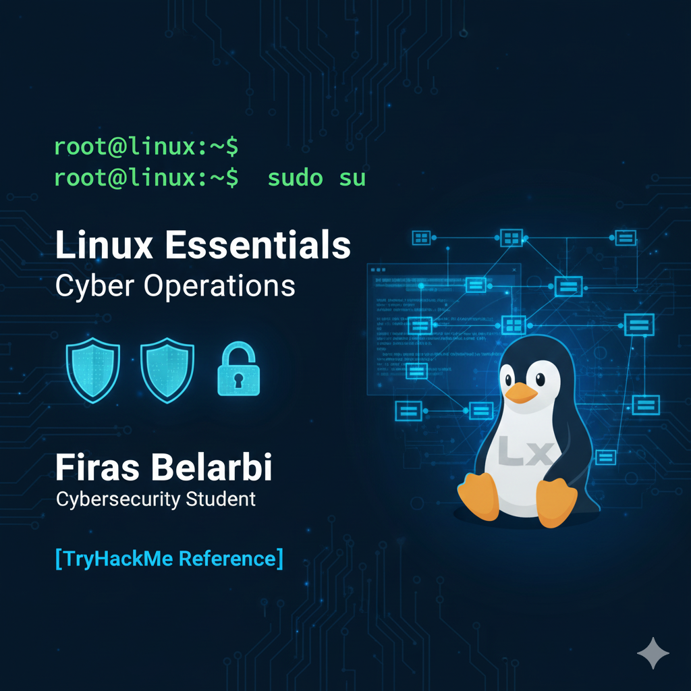

<p align="center">
  
</p>

<h1 align="center">🐧 Linux Essentials — Summary Notes</h1>
<p align="center">
  Foundations of Linux for cybersecurity and IT operations.
</p>

---

## 📘 Introduction
Linux is the backbone of modern cybersecurity.  
Whether you work in:

- SOC (Security Operations Center)  
- Penetration Testing  
- System Administration  
- DevOps / DevSecOps  
- Cloud Engineering  

you will interact with Linux every single day.

This repository contains clean, organized notes based on:
- TryHackMe (Linux Fundamentals)
- University networking & OS courses
- Practical terminal exercises
- VirtualBox / VMware labs

---

## 🔧 1. Basic Linux Commands

| Command | Description |
|--------|-------------|
| `pwd` | Print working directory |
| `ls` | List files/folders |
| `cd` | Change directory |
| `mkdir` | Create directory |
| `rm` | Remove file |
| `rm -r` | Remove folder recursively |
| `cp` | Copy files |
| `mv` | Move or rename file |

---

## 📁 2. File Permissions (rwx)

Linux permissions are divided into:

- **r** → read  
- **w** → write  
- **x** → execute  

### Change file permissions:
```bash
chmod 755 file.txt
```

### Change file owner:
```bash
chown user:user file.txt
```

---

## 👑 3. SuperUser & Sudo

### Important commands:
```bash
sudo su
```

- `sudo` → run one command as root  
- `su` → switch to root permanently inside the shell  

---

## 📦 4. Package Management

### Debian / Ubuntu (APT)
```bash
sudo apt update
sudo apt upgrade
sudo apt install <package>
```

### RedHat / CentOS (YUM)
```bash
sudo yum install <package>
```

---

## 🌐 5. Networking Commands

| Command | Use |
|--------|-----|
| `ifconfig` / `ip a` | View network interfaces |
| `ping` | Test connectivity |
| `netstat -tulnp` | Show open ports |
| `ss -tulnp` | Modern replacement for netstat |
| `curl` | Send HTTP requests |
| `wget` | Download files |

---

## 🔍 6. System Monitoring

| Command | Description |
|--------|-------------|
| `top` | Live process monitoring |
| `htop` | Enhanced version of top |
| `ps aux` | List all running processes |
| `df -h` | Disk space usage |
| `du -sh` | Folder size |

---

## 🐚 7. Bash Scripting

### Simple Bash script example:
```bash
#!/bin/bash
echo "Hello Linux!"
```

Make it executable:
```bash
chmod +x script.sh
./script.sh
```

---

## 🛡️ 8. Security Best Practices

- Never stay logged as root unless necessary  
- Use strong file permissions  
- Keep the system updated  
- Avoid unnecessary services running  
- Prefer SSH keys over passwords  
- Follow "Least Privilege" principle  

---

## 📚 References

- TryHackMe — Linux Fundamentals  
- Linux CLI practice labs  
- Notes curated by **Firas Belarbi**, Cybersecurity Student (2025)

---

## ⭐ Support the Project

If you find this repository helpful:  
**Give it a Star ⭐**  
**Follow the profile 👤 for more cybersecurity content**

---
